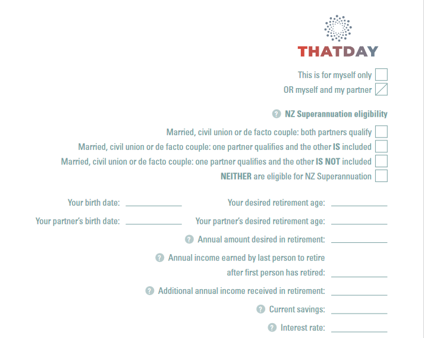

# <a href="https://mahmudul-hasan-bijoy.github.io/kallayas/" target="_blank">Onepage Form</a> 

- Onepage Website
- HTML5
- CSS3
- Ruby SASS/SCSS
- Bootstrap 4
- devDependencies: npm package

  <a href="https://github.com/actions/setup-node/actions?query=workflow%3Abuild-test">
  
## NPM SCRIPTS

- `npm install`: Run `npm install` under root directory to install npm packages.

- `npm run start`: Run the website on a live server & compile SASS to CSS
- `npm run build:css`: Compile all the SASS files, concatinating, autoprefix and compress CSS/JS into a minified version
- `npm run build:bootstrap`: Automatically make relevant files for bootstrap and put them into their related diretory

## RUBY SASS INSTALL

- Download Ruby: Download `Ruby` from its official website & install it on your machine.
- Check Version: After installation go to your command window and type `ruby -v` to check installed Ruby version.
- Install SASS: Type `gem install sass` to install Ruby SASS on your machine.
- Check SASS version: Now again type `sass -v` to check the installed SASS version.
- Initialize SASS on this project: type `sass --watch main.scss:../css/style.css --style compressed` and you are on your way to  run Ruby SASS for this project.
  
## License

